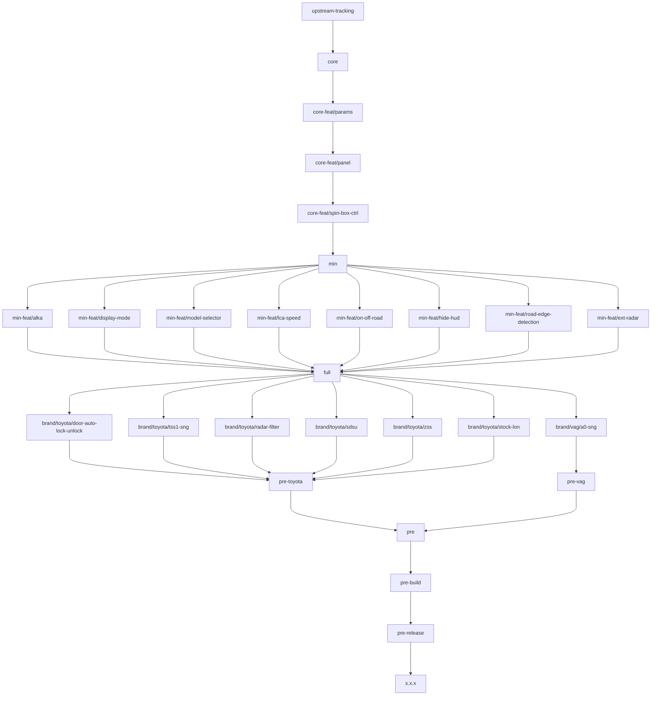

```mermaid
flowchart TD
    B000["upstream-tracking"] ---> CORE["core"]
    CORE ---> CORE_001["core-feat/params"]
    CORE_001 ---> CORE_002["core-feat/panel"]
    CORE_002 ---> CORE_003["core-feat/spin-box-ctrl"]
    CORE_003 ---> MIN["min"]
    MIN ---> MIN_001["min-feat/alka"]
    MIN ---> MIN_002["min-feat/display-mode"]
    MIN ---> MIN_003["min-feat/model-selector"]
    MIN ---> MIN_004["min-feat/lca-speed"]
    MIN ---> MIN_005["min-feat/on-off-road"]
    MIN ---> MIN_006["min-feat/hide-hud"]
    MIN ---> MIN_007["min-feat/ext-radar"]
    MIN ---> MIN_008["min-feat/road-edge-detection"]
    MIN_001 ---> FULL["full"]
    MIN_002 ---> FULL
    MIN_003 ---> FULL
    MIN_004 ---> FULL
    MIN_005 ---> FULL
    MIN_006 ---> FULL
    MIN_008 ---> FULL
    MIN_007 ---> FULL
    FULL ---> TOYOTA_001[brand/toyota/door-auto-lock-unlock]
    FULL ---> TOYOTA_002[brand/toyota/tss1-sng]
    FULL ---> TOYOTA_003[brand/toyota/radar-filter]
    FULL ---> TOYOTA_004[brand/toyota/sdsu]
    FULL ---> TOYOTA_005[brand/toyota/zss]
    FULL ---> TOYOTA_006[brand/toyota/stock-lon]
    FULL ---> VAG_001[brand/vag/a0-sng]
    TOYOTA_001 ---> TOYOTA[pre-toyota]
    TOYOTA_002 ---> TOYOTA
    TOYOTA_003 ---> TOYOTA
    TOYOTA_004 ---> TOYOTA
    TOYOTA_005 ---> TOYOTA
    TOYOTA_006 ---> TOYOTA
    VAG_001 ---> VAG[pre-vag]
    TOYOTA ---> PRE[pre]
    VAG ---> PRE
    PRE ---> PRE_001[pre-build]
    PRE_001 ---> PRERELEASE[pre-release]
    PRERELEASE ---> RELEASE[x.x.x]
```
